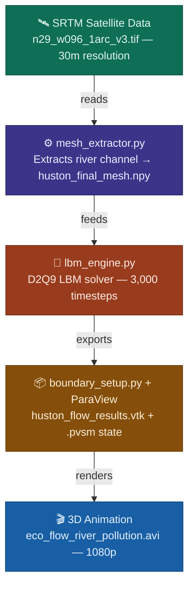

# Eco-Flow River Pollution Simulator

A physics-based 2D fluid simulation built on the Lattice Boltzmann Method (LBM), applied to real satellite terrain data of the 
Houston Ship Channel. The simulation computes hydrodynamic flow behavior across an actual river landscape, identifies low-velocity 
stagnation zones where pollutants and plastic waste concentrate, and exports the results to VTK format for 3D visualization in ParaView.


<p align="center">
  <video src="https://github.com/user-attachments/assets/7963ed29-9eb0-49e9-9743-21dd9e86433f" width="100%" controls></video>
</p>


---

## What This Does

Most pollution dispersion tools treat river geometry as a simplified rectangle or manually drawn boundary. This project pulls real 
1-arc-second SRTM elevation data (USGS tile `n29_w096`), extracts the actual river channel geometry from it, runs a full 
Navier-Stokes-equivalent fluid simulation on that terrain, and renders the velocity field in 3D.

The dark regions in the final render are where velocity drops near zero. In a real river, these are exactly where plastic waste, 
sediment, and chemical runoff accumulate. The simulation makes those accumulation zones visible and spatially accurate.

---

## Pipeline Overview



---

## Files

| File | Purpose |
|---|---|
| `mesh_extractor.py` | Reads the SRTM `.tif`, thresholds elevation to extract the river channel mask, saves as `.npy` |
| `lbm_engine.py` | Core LBM solver — runs 3,000 timesteps of D2Q9 fluid dynamics on the mesh |
| `boundary_setup.py` | Handles inlet/outlet boundary conditions and ParaView export prep |
| `huston_final_mesh.npy` | Binary river channel mask derived from real satellite elevation data |
| `huston_flow_results.vtk` | Full velocity vector field output, ready to load in ParaView |
| `eco-flow river pollution.pvsm` | ParaView state file — reproduces the exact 3D render including StreamTracer, elevation colormap, and animation |
| `eco flow river pollution.avi` | Final rendered animation |
| `n29_w096_1arc_v3.tif` | Raw SRTM elevation tile (Houston, TX) from USGS |

---

## Physics

The solver uses the **D2Q9 Lattice Boltzmann Method** — a mesoscopic fluid model that recovers Navier-Stokes behavior in the low-Mach, 
incompressible limit.

Key parameters:
- **Lattice:** D2Q9 (9 velocity directions in 2D)
- **Collision operator:** BGK (Bhatnagar-Gross-Krook) with relaxation parameter `ω = 1.2`
- **Timesteps:** 3,000
- **Inlet velocity:** `u_max = 0.05` (dimensionless lattice units, kept low for numerical stability)
- **Boundary conditions:** Bounce-back on solid walls, fixed-velocity Dirichlet inlet, outflow copy at the outlet

The equilibrium distribution function used:

```
f_eq[i] = ρ · w[i] · (1 + 3·(c·u) + 4.5·(c·u)² − 1.5·|u|²)
```

Where `c` is the lattice velocity vector for direction `i`, `ρ` is local density, and `w[i]` are the D2Q9 weights.

---

## Data Source

Terrain data: **SRTM 1 Arc-Second Global** (USGS EarthExplorer, Tile `n29_w096`)  
Coverage: Houston Ship Channel and surrounding watershed, Texas, USA  
Resolution: ~30 meters per pixel

---

## Dependencies

```
numpy
matplotlib
gdal / rasterio       # for reading .tif elevation data
paraview              # for .pvsm state and 3D rendering
```

Install Python dependencies:
```bash
pip install numpy matplotlib rasterio
```

ParaView (5.11+) is required for visualization. Download at [paraview.org](https://www.paraview.org/download/).

---

## How to Run

```bash
# Step 1 — extract the river mesh from satellite data
python mesh_extractor.py

# Step 2 — run the LBM simulation (takes ~2–5 minutes depending on hardware)
python lbm_engine.py

# Step 3 — open ParaView and load the state file
# File → Load State → eco-flow river pollution.pvsm
```

The `.pvsm` state file will automatically load `huston_flow_results.vtk` and reproduce the full 3D render.

---

## Visualization

The ParaView pipeline uses:
- **Elevation scalar field** mapped to terrain color (black = low, tan = high)
- **StreamTracer** seeded from the inlet, colored by velocity magnitude
- **Velocity colormap** (blue = ~0.00 m/s, orange = ~0.05 m/s)
- **Stagnation zones** visible as near-black regions where flow velocity approaches zero — the primary accumulation sites for floating
- debris and chemical pollutants

---

## Extending This Project

Open issues and ideas for contribution:

- [ ] Add a passive scalar transport equation to simulate an actual pollutant concentration field
- [ ] Port the LBM solver to run on GPU via CuPy for faster iteration
- [ ] Swap the Houston terrain for an African river basin (Niger Delta, Benue River)
- [ ] Add a residence-time scalar derived from inverse velocity to directly map accumulation risk
- [ ] Build a Trame/ParaViewWeb frontend so the simulation is accessible in a browser

Pull requests are welcome. If you're working on any of the above, open an issue first so we can coordinate.

---


